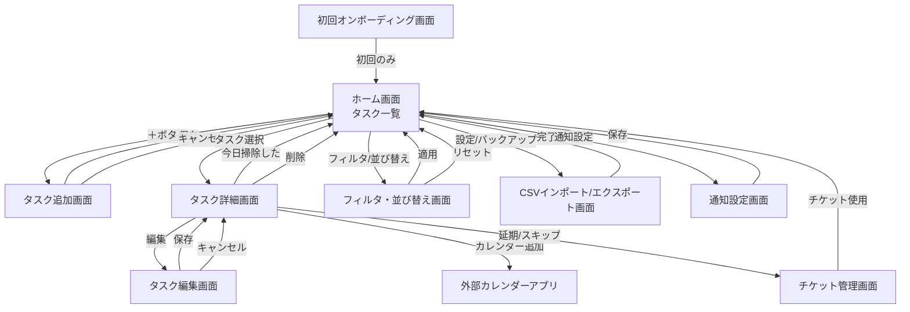

# 掃除記録・習慣化アプリ

画面遷移図（Screen Flow）

---

## 1. 画面一覧（MVP + 拡張）

### MVP 画面

- ホーム画面（タスク一覧）
- タスク追加画面
- タスク詳細画面
- タスク編集画面
- CSV インポート / エクスポート画面

### 拡張画面

- フィルタ・並び替え画面
- 通知設定画面
- チケット管理画面
- 初回オンボーディング画面

---

## 2. 画面遷移図（Mermaid 記法）

> ※ GitHub / Obsidian / Mermaid 対応 Markdown でそのまま描画可能

